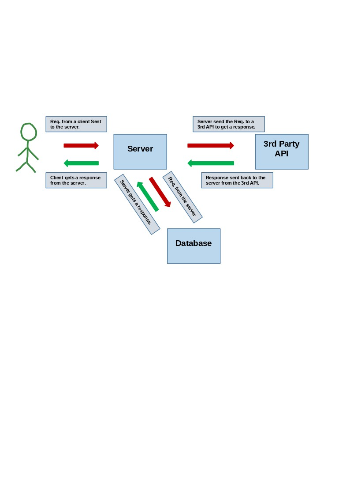

# Movies-Library- Project Version  "1.0.0"

**Author Name**: Balqees Al-Qudah

## WRRC

## Overview

setting up a server for a movie app and create the basic structures, that  can check the latest movies based on categories.

## Getting Started

-**First step**
Creating a new repository, and checkout a new branch.

-**Second step**
To start using packages by run command(npm init -y), it will create a default package (package.json) which will hold the description of your file and dependencies that have been installed.

-**Third step**
Install packages that i need to use and in this project I installed express, cors.
then you will declare a 2 variables one with express and the other with cors, like
(let data= require("express"))>>> (const app=express()); by using require here data will be as a function. in this case all the methods inside express will be stored in data variable.

-**Fourth step**
Starting point of any project is to create JS file (index.js), and in our lab we have named it (server.js), then will start writing our code; as we said declaring variables for express & cors, then we need to let the server run in aport using ((name of variable i assigned to app)(app).listen) where it takes two parameter (port,call back function)

-**Fifth step**
To get  routes we use (.get("",call back function)) an example
app.get ("/home",handleHome) >>> ("/home") here the path that your localhost ends with , will go to handleHome function which will be explained later. (localhost:3000/home)

-**Sixth step**
Creating Handler functions that takes two parameters request and response
function handleHome(req,res){
  res.send("Welcome to our home page")
} here the response will be displayed on my server when i run it by using(.send)
-**Seventh step**
Adding a 3rd API which is TMDB to get data using axios library along with async/await keywords.

## Project Features

project holds the port will be running on which is here 3001, and also the get routes are ("/") for home page, ("/favorite") for favorite page, and ("*") for any other resources, and for their handler functions; home handler function will resend a json formatted of the movie we have on our server, and favorite handle function will resend("welcome to our favorite page") and lastly for handling the errors for typing any other routes will provide error 404, and also added a server error function if that server has some error.

**Updates** send get requests to a 3rd party API and display data; project now holds also the ('/search'), ('/trending'), ('/top_rated'), and ('/tv_list') endpoints, to search for any movie, trending, top 10 movies, or for tv lists.

**New Updates**
Used postgresSql to manipulate a (movies) table in the database (movieslibrary) using CRUD operations (creating/ inserting a new movie) using post request, and get the movies data from the database using get request to get all the data inside database
